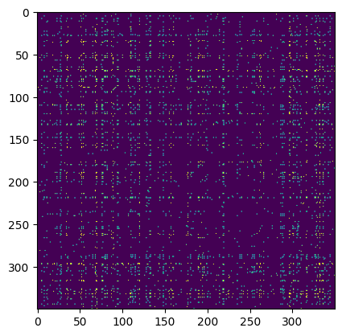
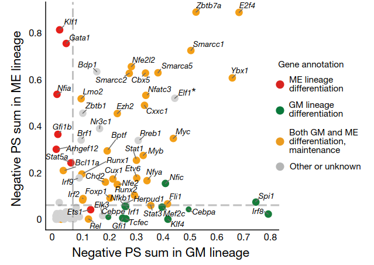
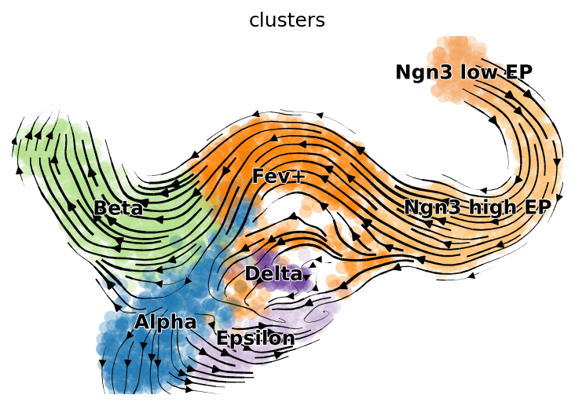
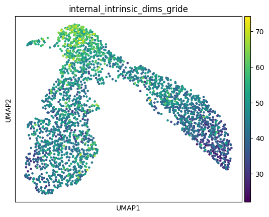
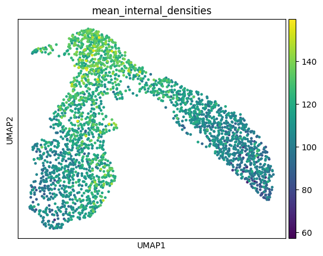

In a previous essay, I posed a question: has nature been exhausted of all its general biological laws, leaving us with only factoids to collect, or are there yet more general laws of biology to discover? If so, what form will they take?

This essay is a first pass at answering those questions. It has two main aims:
- To showcase the capabilities of encoder models trained on large amounts of single-cell transcriptomic data, which will capture general laws of biology and form the basis of a new class of biomedical research tools.
- To use these models to put forth a quantitative framework for modeling agentic systems, which extends across scale and substrate.

That is, in this essay I hope to operationalize, to a first approximation, the "totalizing ML" mindset I discussed in my [previous essay](https://markov.bio/biomedical-progress) (read that to understand the theoretical motivations of this piece). This essay should be read as a provocation, and a somewhat slapdash one at that; I leave to future work (hopefully taken up by someone with a more academic bent) a proper, systematic evaluation of the performance of the models I outline here compared to existing approaches. Additionally, I should note there's a tremendous amount that has been left unsaid about how these models will evolve; let's just say encoder models are merely a starting point.

The essay has two parts:

In Part 1, we will briefly review the research agenda of the single-cell computational biology community over the past ten years and what fruit it has borne. We will also introduce evolutionary structure models for single-cell transcriptomic data, and demonstrate how these models learn increasingly higher-order structural patterns, simply by training on bags of gene counts. In doing so, we will touch on some research affordances these models enable.

In Part 2, we will interrogate the statistical signatures of these models and connect a couple literatures related to intrinsic dimensionality and scaling behavior. We will then extend our encoder models to spatial data. Doing so will provide an intuition pump for understanding what these models are actually encoding: agents' internal models of their niche, which are used for prediction and action. We will then discuss the role of Markov Boundaries in these internal models, and gesture at how we might attempt to develop a language for talking about how agency composes across levels of hierarchy.

# 1. Semantics With Scale

## The ESM Insight

In April of 2019, a [preprint](https://www.biorxiv.org/content/10.1101/622803v1?versioned=true) was published by Rives et al. on BioRxiv, "Biological Structure and Function Emerge from Scaling Unsupervised Learning to 250 Million Protein Sequences". The authors trained masked language models on a diverse corpus of protein sequences. The approach was rather simple: instead of training a model to predict the masked token as one would do with large language models, the authors masked the linear amino acid sequence of a protein and asked the model to predict the missing amino acids. By doing so, the model learned to represent variable-length proteins as vectors in a protein embedding space.

Some of the results of these embeddings were rather innocuous: the model learned to cluster amino acids (which themselves have contextual embeddings of the same size as the protein embeddings) based on their biochemical and molecular properties, like size and hydrophobicity. However, the model also gained more interesting capabilities, like the ability to cluster orthologous proteins (i.e., genes from different species which have similar functions) and reconstruct phylogenetic trees across dozens of species (by using species-average protein embeddings). But perhaps the most impressive result was the model's ability to predict secondary structure and [tertiary contacts](https://en.wikipedia.org/wiki/Protein_tertiary_structure) (i.e., to do protein-folding), despite having never been trained on anything other than linear sequence data--an ability which improved when the pretrained models were fine-tuned on a small amount of folding data. (The model even learned to predict the fitness effects of mutations at different amino acid positions.)

What's most striking is how these abilities improved as model size and dataset diversity were scaled up. For instance, models trained solely on single protein families generalized poorly when predicting the structure of proteins from out-of-distribution families, as compared to models trained and tested on the same protein family; but models pretrained on a diverse body of proteins outperformed even the within-family models. Performance also markedly improved as the parameter count of the model was scaled up, though the authors only went up to a ~650m parameter model, which lacked the capacity to properly fit to the 250m sequences they trained on.

In a [recent follow-up](https://www.biorxiv.org/content/10.1101/2022.07.20.500902v3.full.pdf), however, they scale these models all the way up to 15B parameters and demonstrate predictable improvements in downstream structure prediction over multiple orders of magnitude of scale. Admittedly, the protein-folding performance isn't quite on par with that of folding-specific models. But it would be a grave mistake to cast this class of models as merely a lighter-weight, slightly inferior version of AlphaFold, as some have done.

The name these models were given, Evolutionary Scale Modeling (ESM, though a more apt name would be Evolutionary _Structural_ Modeling, in my opinion), captures the non-trivial insight they're based on:

> The emergence of atomic level structure in language models reveals a high resolution picture of protein structure **that is encoded by evolution into sequence patterns** across millions of proteins, adding to the evidence that the unsupervised training objective materializes deep information about the
biology of proteins.

To spell it out in the case of proteins: of the space of all possible amino acid sequences, only a very small percentage actually exist. This existence (and corresponding non-existence), which is captured by the data distribution of proteins, encodes rules about what makes proteins fit or non-fit--their secondary, tertiary, and even higher-order structure (like protein-protein interaction). This is why these protein language models (pLM) are able to predict higher-order structure despite never being explicitly trained on it.

But this statement can be abstracted far beyond proteins into a more general principle: the censored data distribution produced by some evolutionary data-generating process implicitly captures the rules of that censoring process (i.e., the fitness function). If you train a neural network on this data distribution, the resulting model will encode [impressions](https://www.youtube.com/watch?v=QU0ciTXUJY4) of the higher-order structures the fitness function is selecting on.<input type="checkbox" id="cb20" /><label for="cb20"></label>  Perhaps this can generalized even further, to any sort of data-generating process, evolutionary or not, which [a model must](https://www.youtube.com/watch?v=Yf1o0TQzry8) implicitly learn a "world model" of in order to reduce loss; whether this will be learned efficiently is an entirely different question..  

So, one might ask, can this principle be ported to, say, single-cell transcriptomic data? What higher order structures (the analogs of protein folding, mutation fitness prediction, protein-protein interaction, etc.) might these models learn to encode?

Before we attempt to answer that question, we must first do a brief review of existing approaches to single-cell biological data.

## A Brief History of The Single-Cell Computational Biology Field

In response to exponential progress in tools for reading state from single cells over the past decade or so, an academic sub-field, which we'll call the "single-cell computational biology" field, sprang up.

The start of this field is best dated to a [seminal 2014 publication](https://www.nature.com/articles/nbt.2859) by Trapnell et al., in which they pioneered a method called "pseudotime". This paper set the direction of the single-cell community over the past roughly 10 years, so it's worth reviewing briefly.

The motivation of the paper is as follows: single-cell RNA sequencing allows us to parse transcriptomic heterogeneity at higher resolution, but the destructive nature of the technique means we cannot longitudinally profile a cell over time. Therefore, we'd like a means of reconstructing single-cell trajectories, e.g. differentiation, from these destructive snapshots of cellular state.

Trapnell et al.'s solution was to represent each cell as a point in high-dimensional gene expression space. Linear dimensionality reduction is then performed to compress the cells into a lower-dimensional embedding, with cellular proximity proportional to transcriptional distance. A neighbor graph is then fit among the cells in this space, and directional paths, known as "trajectories", are then found on this neighbor graph. These trajectories are meant to model biological processes like cell differentiation and branching.

The method is known as "pseudo"-time because the cells aren't ordered according to wall clock time (e.g., the day of development they were collected at), but by their order in the embedding space, which is based on the transcriptional similarity graph.

Many interesting things can be analyzed over these pseudotime trajectories: the upregulation of particular genes as cells navigate a branching point, the co-expression of different genes in cell type clusters, etc.

But what's worth dwelling on is the non-parametric dimensionality reduction techniques that are used to embed the cells before the neighbor graph is constructed. These techniques are non-parametric in the sense that the resulting embeddings depend solely on the data they are fed; no pretraining of a model comes into play. Therefore, if you want to compare embeddings of cells from two different studies, you'll have to first embed them _together_ using these techniques.

As I noted in my earlier piece, the single-cell biology community has developed a fixation with these embedding methods, perhaps due to the beautiful plots they produce. Though the methods have been updated slightly--now standard practice is to first do linear dimensionality reduction (PCA instead of ICA) over pre-processed (e.g., normalized and log-transformed) gene count data, and then perform non-linear dimensionality reduction (typically UMAP or tSNE) to get your final 2D embeddings--their non-parametric nature remains the same. This fixation with non-parametric dimensionality plots and a love for creating dozens of similar task-specific algorithms are two of the defining features of the single-cell computational biology community over the past 10 years:

> Somewhat ironically, the ability to parse biological heterogeneity has driven methodological homogenization of the field. Papers are now rather formulaic, including basically the same types of data, analysis and figures—a dimensionality reduction plot of single-cell profiles (i.e., a “single-cell map”), a volcano plot showing differential gene expression between two conditions, a visualization of the inferred gene regulatory network, and a matrix of gene expression values across pseudotime for key gene regulatory nodes.  Every year or two a fancy new analysis method will come along, which is [aped by the entire field](https://mobile.twitter.com/shchurch/status/1532422321771843584): there are [more than 70 methods](https://www.nature.com/articles/s41587-019-0071-9) for inferring cellular trajectories on single-cell maps, [a dozen methods](https://www.nature.com/articles/s41576-020-00292-x) for inferring cell-cell communication from gene expression data, and a [dozen methods and counting](https://academic.oup.com/bib/article/22/3/bbaa190/5904505) for inferring gene regulatory networks. Research has to an extent become paint-by-numbers: do single-cell omics on your biological system of study, apply new single-cell analysis method X to the data, and then tell a compelling mechanistic story about the results.  (Single-cell maps have become so important to the field of computational biology that these maps are [now being made accessible](https://www.biorxiv.org/content/10.1101/2021.10.07.463279v2) to the color-blind.)

The field has certainly come up with methodological innovations--like [augmenting these](https://www.nature.com/articles/s41592-021-01346-6) non-parametric fate-prediction algorithms with [transcriptional splicing data](https://www.nature.com/articles/s41586-018-0414-6) or learned (i.e., parametric) [transcriptional kinetics kernels](https://www.nature.com/articles/s41587-023-01728-5) to better predict cellular fate--but these are incremental improvements. On the whole, the field is intellectually stagnant, mired in fashion, due in large part to their failure to question the non-parametric embedding assumption baked into most of their models.

This isn't to say there aren't exceptions--for instance, [TrajectoryNet](https://arxiv.org/abs/2002.04461) was an excellent paper which fit Neural Ordinary Differential Equations (a parametric model) to differentiation data, and more recently there have been [some](https://www.biorxiv.org/content/10.1101/2021.04.14.439903v2) interesting [papers](https://arxiv.org/pdf/2204.13545.pdf) on using autoencoders to model the effects of single-cell perturbations--but until the past five years there was [nary an autoencoder](https://europepmc.org/backend/ptpmcrender.fcgi?accid=PMC6289068&blobtype=pdf) in sight, let alone a language model, and all these models still are highly task-specific.<input type="checkbox" id="cb1" /><label for="cb1"></label>  Though this is to be expected, since the single-cell computational biology field has tended to lag the broader machine learning community [by 3-5 years](https://www.youtube.com/watch?v=aYB2TXLOeLY&t=489s). How much of this is attributable to [questions of human capital](https://www.lesswrong.com/posts/Sh8qjH3GPpBvMu7ac/stories-about-academia#Physics__Biology__and_Polymaths) is worth thinking about. A good starting point might be examining the origins of the field's [academic lineage](https://academictree.org/computerscience/index.php) and how it may have set the field on its current course.  

So, we might ask, if we were to approach the single-cell problem domain anew, without any limiting assumptions, how might we do it? What would the field look like if it sloughed off the [fancy optimal transport regularization](https://proceedings.neurips.cc/paper_files/paper/2022/file/bfc03f077688d8885c0a9389d77616d0-Paper-Conference.pdf) techniques and stopped futzing with incremental improvements from [geometric learning](https://openreview.net/pdf?id=jH6pg6JaSP2)? That is, what would the field look like if it bit the scaling bullet and caught up with the rest of the machine learning community?

Well, though it's hard to envision how the field could be transformed so radically, a good first step would be training a large language model on single-cell data.

### Masked Language Modeling Almost Comes to Single-Cell Biology

There have been [a few](https://www.nature.com/articles/s42256-022-00534-z) public [attempts](https://www.biorxiv.org/content/10.1101/2022.11.20.517285v1.full.pdf) to do masked language modeling on single-cell transcriptomic data.<input type="checkbox" id="cb2" /><label for="cb2"></label>   The [myopic](https://openreview.net/forum?id=7hdmA0qtr5&noteId=qx00Dp4r_VD) reactions of the [ICLR reviewers of scFormer](https://openreview.net/forum?id=7hdmA0qtr5&noteId=FJGbwV409c), which was rejected by the conference, are telling.  

Some of these papers make some strange architectural and training objective choices. <input type="checkbox" id="cb3" /><label for="cb3"></label>   scBERT didn't even learn proper gene embeddings, instead opting to first use gene2vec to encode genes. scFormer chose to augment their gene tokens with "external tokens", e.g. "pathway tokens", which were meant to inject existing knowledge about which biological pathway a gene is active in.   scFormer also introduces a bunch of nonsensical objectives to augment the main masked language modeling objective, like a separate MLP to predict the cell's batch (in order to mitigate the batch's effect on the representation) and a contrastive loss (the purpose of which is unclear). Note also how both papers hew to the standard single-cell transcriptomics processing pipeline (count normalization, log-transformation, and restricting their analysis to highly variable genes). It's hard to untether oneself from tradition.   

But most importantly, the vast majority of these papers lacked ambition, framing their methods as modest improvements to canonical single-cell tasks (cell type annotation, batch correction, perturbation prediction--which is slightly more interesting), and few attempt to scale, either in data or parameters.<input type="checkbox" id="cb4" /><label for="cb4"></label>  Though note the very recent [scGPT](https://www.biorxiv.org/content/10.1101/2023.04.30.538439v1.full.pdf), an autoregressive (i.e. non-MLM) model which trains on a largish, but not diverse, set of 10 million blood and bone-marrow cells. Note also the [very recent paper](https://www.nature.com/articles/s41586-023-06139-9) Geneformer, which trains on 30m cells.

So, an attempt at scaling single-cell masked language models, and a proper explanation of what they mean, seems badly needed. If the analogy to protein modeling is correct, such a model could get us a whole lot more than improved cell-type annotation.

## ANDRE

ANDRE (AgeNtic Density Representation Encoder, a name I've chosen in the spirit of contrived and whimsical machine learning model names, and which will later make a bit more sense) is an encoder model trained on single-cell transcriptomic data. I've trained a ~250m parameter version on a diverse set of ~20 million cells from ~500 human and mouse datasets (at roughly a 3:1 ratio by cell count) at a sequence length of 512, for a total of 10B tokens trained on. Since this model isn't huge, we'll call it ANDRE-medium (ANDRE-large had some issues with hyperparameters, so I leave it and ANDRE-giant, and a proper parameter scaling analysis, to future works). Here's the obligatory training run plot. <input type="checkbox" id="cb5" /><label for="cb5"></label>  The data scaling exponent in log-log space seems to be around -0.1, at least in the 100 to 1000 batches range.

First I'll discuss how this was done and provide some analogies for how to think about the training objectives. Then we'll look at the increasingly higher-order structures the model learns, and how they might form the basis of novel biomedical research affordances.

### A Transcriptome is a Bag-of-Transcripts, Not a Sentence

In the few instances where language models are talked about in the context of single-cell transcriptomic data, there's often an incorrect appeal to "cells as sentences". This metaphor is doubly harmful: not only are single-cell transcriptomic profiles not analogous to sentences (sentences have a linear order, whereas gene counts do not), but this misconstrual also acts as an obstacle to a proper analogy for how to use position embeddings to model single-cell data.

A single-cell is both literally and figuratively a [bag-of-transcripts](https://en.wikipedia.org/wiki/Bag-of-words_model), an (unordered) set which can have multiple instances of each gene (counts). To understand how these counts will be encoded by our model, we need to understand how large language models encode position.

In masked language modeling, generally speaking, a token's embedding is just the sum of its input embedding (corresponding to the actual token from the vocabulary), its position embedding, and, if applicable, its token type embedding. The way LLMs add the position embedding is simply by constructing a sequence of integers, starting with 0, equal to the length of the text sequence, and using these as indices to pull corresponding position embeddings from the position embedding lookup table, which are added to the input ID embedding. That is, but for these position embeddings, the model does not know one word is to the left or right of the other (except in the case of autoregressive language modeling, where the attention mask tells the model this). The fact that position indices increase left-to-right is arbitrary, as is the idea that position embeddings must represent position in a linear sequence.

So, in the case of single-cell bags of transcripts, we can pass our gene embeddings in any order we wish, as long as we add the corresponding transcript counts as position embeddings.

Perhaps a better metaphor for thinking about position embeddings is imagining a gene regulatory network as a [graph embedded on a Poincaré disk](https://arxiv.org/pdf/1705.08039.pdf), where concentric valences (like electron valences in an atom) represent the "centrality" of the gene, with more medial genes having a stronger role in the gene regulatory network. (This speaks to the geometry of the transcriptome-generating process, which we will touch on later.) Then, if you like, you can imagine ordering your genes left-to-right by their valences, and adding position embeddings in descending order, from highest expression values to lowest.

The training objective of ANDRE is quite simple: a combination of gene embeddings and count embeddings are summed, some portion of these are masked, and the model is tasked with predicting the identity of the masked genes from a vocabulary of around 100,000. Everything is completely learned from scratch: no prior information about genes or the datasets the cells come from is injected into the model.

I'll spare you the rest of the gory details, relegating some of them to a sidenote for those interested.<input type="checkbox" id="cb6" /><label for="cb6"></label>  Here are some of the gory details. The model is trained on raw count data--no normalization, log-transformation, etc. is performed. The only preprocessing is capping the maximum expression value to the maximum number of position embeddings. A random subset of 512 non-zero-expression genes is chosen from each cell, and if there are fewer, the cell is padded. The model has 12 layers, 12 attention heads, and a hidden dimension of 768, like the original BERT model. However, unlike the BERT model, there is no next sentence prediction objective. 

Let's now get into what ANDRE learns. We will work our way through three levels of increasingly higher-order structural information the model learns to encode. Again, the point is not to provide a systematic evaluation of these models as compared to existing methods, but to highlight some of the novel research affordances they enable, and hint at what might be learned with greater scale.

### Gene Regulatory Prediction

The single-cell transcriptomic analog of protein-folding might be something like "regulatory folding", or predicting the regulatory "contacts" between genes in the cell. That is, ANDRE might be able to tell us which genes correlate in expression, and perhaps which genes regulate each other, simply by looking at the way genes attend to each other inside the model. And much like protein-folding, we can plot this attention as a matrix (but unlike the below plot, it will not necessarily be symmetric about the diagonal).

  

Plotted below is an interactive heatmap of the maximum attention across twelve attention heads in the first layer of ANDRE for a megakaryocyte-erythroid progenitor (MEP) cell from a [classic hematopoiesis dataset](https://www.sciencedirect.com/science/article/pii/S0092867415014932?via%3Dihub). Genes have been ordered by their expression to better show clustering (and I've removed all special tokens). I've limited the plot  to the top 128 expressed genes, hence why there are so many ribosomal genes. (You can zoom in on the plot by dragging a rectangular selection.)

<iframe src="https://chart-studio.plotly.com/~markovbio/1.embed" height="500" width="100%" frameborder="0" loading="lazy"></iframe>

Note, for instance, the strong attention in the upper-left submatrix on [TRIM28](https://www.genecards.org/cgi-bin/carddisp.pl?gene=TRIM28), a gene which [controls transcription levels of erythroid transcription factors](https://www.ncbi.nlm.nih.gov/pmc/articles/PMC3843238/) like KLF1 and (at least per this heatmap) GATA2, and plays a [critical role in erythropoiesis](https://www.biorxiv.org/content/biorxiv/early/2022/07/13/2022.07.12.499765.full.pdf). Notice also the strong attention of TRIM28 to other core MEP transcription factors like [MYC](https://www.genecards.org/cgi-bin/carddisp.pl?gene=TRIM28), which is generally important to cell stemness.

Notice also in the leftward columns the broad attention on the [FTL (ferritin light chain)](https://www.genecards.org/cgi-bin/carddisp.pl?gene=FTL) gene, the primary regulator of intracellular iron storage, which seems fitting for an MEP likely fated to become a red blood cell--and notice in particular its attention with GATA2. The high attention between TRIM28 and [TXNIP](https://www.cell.com/cell-metabolism/pdf/S1550-4131(13)00245-3.pdf), which is upregulated in response to oxidative stress in hematopoietic stem cells, is also interesting.

We can compare these attentions to a list of MEP TFs analyzed by [CellOracle](https://celloracle.org/), a [method which](https://www.nature.com/articles/s41586-022-05688-9) predicts gene regulatory networks from both transcriptomic and chromatin accessibility data, as a sanity check (see also their [interactive hematopoiesis network viewer](https://celloracle.org/), which rank-orders TFs by measures like network centrality in their predicted GRN). Though in our heatmap we don't see all of these drivers of megakaryocyte-erythrocyte fate, likely because many are expressed at relatively low levels or will be upregulated as the cell differentiates, the big ones like the GATA family do show up.

### Flow Prediction

In a strange twist of fate, some of the authors of the ESM-2 paper published a [method](https://www.cell.com/cell-systems/fulltext/S2405-4712(22\)00038-2) called Evolocity, which combines non-parametric techniques from single-cell biology with their parametric protein language models to predict the evolution of proteins over timescales ranging from decades (like the evolution of the flu virus over multiple seasons) to eons (large-scale changes in protein sequences across phyla). Their approach can be thought of as analogous to the [transcriptional splicing-augmented](https://www.nature.com/articles/s41592-021-01346-6) single-cell fate models we discussed at the beginning of the piece, but where the embeddings are from a parametric language model (not a non-parametric dimensionality reduction technique) and the directed edge weights on the neighbor graph come not from splicing rates but from the protein language model's parametric mutational likelihoods. The approach is therefore only semi-parametric, because the resulting vector field is data-dependent (it is a vector field defined over the neighbor graph), but it is derived using the embeddings and likelihoods of parametric protein language models.

Since there's no reason why such a model must be limited to evolutionary data, we can port this approach back to single-cell transcriptomics and complete the cycle, deriving semi-parametric flows over cellular state using ANDRE. The implications of this are profound: this means that ANDRE, which isn't trained on longitudinal single-cell data, implicitly captures a cellular state update function--a kind of semi-parametric pseudotime. Given cell state at time _t_, it is able to predict the most likely cell state at time _t+1_, using the "likelihood velocity" which implicitly encodes a flow over cellular states. Extensions of this to "mutation" (e.g., drug perturbation or gene knockout) effect prediction are trivial.

So, let's look at ANDRE's predicted likelihood velocity field on a well known [mouse pancreas developmental dataset](https://cellrank.readthedocs.io/en/stable/api/cellrank.datasets.pancreas.html) (plotted atop non-ANDRE UMAP coordinates, since they look nicer):

  

We can then compare this to the predicted vector field of [CellRank](https://cellrank.readthedocs.io/en/stable/), the sort of non-parametric transcriptional splicing data-augmented model mentioned above:
    

Clearly ANDRE's results leave a lot to be desired (likely due to a poor choice of method for calculating the embeddings which are used to construct the neighbor graph). It mistakenly believes the Ngn-high EP cluster is a sink for the Fev+ cluster, and the vector field in the Alpha and Epsilon clusters region is rather jumbled. But it does a decent job with flow in parts of the Beta cell and Fev+ regions.

There are some obvious ways to improve ANDRE's performance on this task--finetuning on the test dataset, choosing a better method to calculate embeddings using hidden states--but this will suffice as a proof of principle for semiparametric likelihood velocity fields.

### Onward

That could be the start of a predictable story about ANDRE: scale up parameters and data, and watch how performance on these and other downstream structure-learning tasks predictably (or perhaps not so predictably) improves.

But ANDRE raises some tantalizing questions which deserve further inspection. For instance, why might some regions of ANDRE's vector field be smoother and more unidirectional than others? And what if instead of training ANDRE on a mix of 500 datasets, we instead trained it on a single dataset, or even a single cell population? In the next section, we will plant some flags at starting points for answering these questions, and in doing so work our way toward a general quantitative approach for modeling agentic systems.

# 2. Autopoietic Odyssey: Toward a Statistical Physics of Agency

## Dual Scaling Laws: A Tentative Exploration of the Intrinsic Dimension of Single Cell Data
There exists a small machine learning literature (if you could even call it that, since it's composed of only a handful of papers) on the relationship between the scaling exponents of neural networks and the intrinsic dimensionality of the data manifold they are trained on.<input type="checkbox" id="cb7" /><label for="cb7"></label>  There exists an [even smaller literature](https://arxiv.org/pdf/2302.00294.pdf) on looking at the intrinsic dimensionality of representations learned by protein language models, e.g. how certain layers better encode remote homology. Strangely, as we will see, much of this work and work on intrinsic dimension's relationship to phase transitions comes out of Trieste, Italy, which is renowned for its theoretical physics research institute.   However, I believe this literature holds the key to modeling agentic systems across scale and substrate.

The best reference in this literature is [Sharma and Kaplan](https://arxiv.org/abs/2004.10802) (yes, that Kaplan). The paper shows that a neural network's scaling exponent (i.e., the rate at which its loss decreases on a log-log plot as data or parameters are scaled up) is directly proportional to the "intrinsic dimension" ($$I_{d}$$) of the manifold the data distribution lies on, where intrinsic dimension is defined as how many degrees of freedom are needed to accurately describe or represent the data distribution (as contrasted with the larger, ambient dimensionality of the space the data manifold is situated within).

Sharma and Kaplan present two results that are of interest to us:

- The scaling exponent, alpha, is approximately equal to (or lower-bounded by) $$\frac{4}{I_{d}}$$  
- If the manifold is a product of multiple sub-manifolds, the scaling exponent is determined by the maximum of the intrinsic dimensions of these component manifolds

So, I'd like to forward a hypothesis in this vein: gene regulatory networks can be seen as product manifolds, and cellular differentiation can be seen as a process of expanding and contracting the intrinsic dimension of components of this product manifold.<input type="checkbox" id="cb8" /><label for="cb8"></label>  I encourage someone to investigate the product manifold scaling hypothesis using encoder models and [dyngen](https://github.com/dynverse/dyngen).  

There are a few key choices one must make when doing this analysis, the most important being whether to measure intrinsic dimension inside of cells (by looking at the distribution of transcript embeddings) or among cells (by looking at the distribution of cell embeddings). In the case of large language models, Sharma and Kaplan found that the former gave much lower intrinsic dimension estimates than the latter.<input type="checkbox" id="cb9" /><label for="cb9"></label>  There also exist choices about which intrinsic dimension estimator to use, since they have different convergence properties depending on how well-sampled the data is; if you're interested in that kind of thing, [this page](https://dadapy.readthedocs.io/en/latest/implemented_algorithms.html) can act as a starting point for finding references.  

There exists another, [related literature](https://journals.aps.org/prx/pdf/10.1103/PhysRevX.11.011040) on how the intrinsic dimension of toy models like the Ising model (a simple model of magnetic systems) changes as these systems undergo phase transitions. Strangely, most of these papers come out of [world-renowned theoretical physics center](https://www.ictp.it/) in Northern Italy.

The connection between these two literatures is: a cellular differentiation event like branching can be seen as a kind of phase transition, where the cell must break internal symmetry to head toward one of multiple fates. If the analogy is to be believed, the topological signature of this gene regulatory network symmetry-breaking can be cashed out in terms of the intrinsic dimensions of the GRN's modules. One might posit, for instance, that just as there are “driver transcription factors" which upregulate to send a cell toward a particular cell fate, so too are there higher-order "driver modules" which will have a particular intrinsic dimensionality signature, and these statistical signatures will determine the control structure of the cell (and how tractable it is as a function of data and model scale). I'll leave for another day a proper analysis of these phase transitions in single cell data (and a spiel about critical behavior) and present these plots of the intracellular intrinsic dimensions and densities of the earlier hematopoiesis dataset without further comment.

  

  

## Signatures of Selection and Sociality

To return to the evolutionary insight we began the piece with, evolution contours or carves regions of cellular state-space through selection. The dimensionality of these regions might reflect a kind of conservation metric: tighter dimensionality bottlenecks reflect trajectories in state-space that must be threaded more precisely. But what, exactly, do the cellular states actually represent? What are the cells actually _doing_?

To answer that, let's return to our encoder models. We can extend ANDRE to spatial data simply by passing in an additional type of embedding that encodes cell's positions relative to one another. Plotted below is the resulting attention heatmap for a group of four cells (I've deliberately omitted the gene names):

<iframe src="https://chart-studio.plotly.com/~markovbio/6.embed" height="500" width="100%" frameborder="0" loading="lazy"></iframe>

The checkerboard heatmap shows the attentions within and between these four cells. I think this provides a good intuition pump for answering our question: cellular states are best thought of as representing an internal model of the niche the cell finds itself in, and our encoder model asymptotically approaches this local internal agent model as we more densely sample from that region of state space.

The framework for understanding how this niche modeling happens is the [free energy principle](https://en.wikipedia.org/wiki/Free_energy_principle). Though typically thought of as the preserve of strange neuroscientists and philosophers of mind, this framework holds the key to extending our encoder framework across scales.

> The free energy principle is a mathematical principle in biophysics and cognitive science (especially Bayesian approaches to brain function, but also some approaches to artificial intelligence). It describes a formal account of the representational capacities of physical systems: that is, why things that exist look as if they track properties of the systems to which they are coupled. It establishes that the dynamics of physical systems minimize a quantity known as surprisal (which is just the negative log probability of some outcome); or equivalently, its variational upper bound, called free energy. The principle is formally related to variational Bayesian methods and was originally introduced by Karl Friston as an explanation for embodied perception-action loops in neuroscience, where it is also known as active inference.
>
> The free energy principle models the behavior of systems that are distinct from, but coupled to, another system (e.g., an embedding environment), where the degrees of freedom that implement the interface between the two systems is known as a Markov blanket. More formally, the free energy principle says that if a system has a "particular partition" (i.e., into particles, with their Markov blankets), then subsets of that system will track the statistical structure of other subsets (which are known as internal and external states or paths of a system).
>
> The free energy principle is based on the Bayesian idea of the brain as an “inference engine.” Under the free energy principle, systems pursue paths of least surprise, or equivalently, minimize the difference between predictions based on their model of the world and their sense and associated perception. This difference is quantified by variational free energy and is minimized by continuous correction of the world model of the system, or by making the world more like the predictions of the system. By actively changing the world to make it closer to the expected state, systems can also minimize the free energy of the system. Friston assumes this to be the principle of all biological reaction.

We can now recast our encoder models as parametrizing single cells' sensory-action "beliefs", and the vector flow fields as attractors over these belief states. The intrinsic dimensionality represents the degrees of freedom of this internal model. As a cell terminally differentiates, it anneals its generative model of its niche (i.e. of its sensory-action feedback loop with the environment), thereby minimizing an upper bound on surprisal. <input type="checkbox" id="cb10" /><label for="cb10"></label>  Intrinsic dimension is really only a first-order approximation of agent degrees of freedom or "competency". If an agent briefly occupies a high-dimensional space but then careens off into randomness, we shouldn't call this high-agency. Therefore we need a [path integral formulation](https://arxiv.org/pdf/2210.12761.pdf) of our agency measure.  

The cellular boundary can therefore be seen as a Markov Boundary, the statistical partition which mediates the dialogue between external states and internal agent states.

Now imagine taking our above spatial heatmap and zooming out, extending our spatial attention plot to cover a broader swath of tissue, say hundreds or thousands of cells: what might we see? It would probably look quite similar to what you see when you zoom in on any of the intra-cellular sub-heatmaps: a kind of attentional clustering of smaller modules within larger modules, except with clustering determined largely by spatial proximity (local cells attend most to cells near them) rather than by proximity on the gene regulatory graph. And if we zoomed out further still, as we lost more resolution, we would probably see something similar with smaller spatial patches nested within larger spatial patches. Thus, a spatial slice of tissue isn't merely a homogeneous collection of individual sub-agents, but a sparsely connected, hierarchical super-agent, just as a single cell is with respect to its internal genetic module sub-agents.

The key insight from the free energy principle is that the states of these sub-agents must _necessarily_ be coarsened from the point of view of the super-agent. Just as gene counts are actually a quantized version of a higher-dimensional, slightly smoother space of transcripts, so too are single cells seen as quantized, visually coarsened squares from the perspective of a large tissue super-agent. These quantized sub-agents constitute the super-agent's internal model and Markov Boundary.
 
We can now recast our intrinsic dimensionality analysis as a means of measuring the degrees of freedom of agents as a function of the degrees of freedom of their internal sub-agents, and those sub-agents' internal models composed of their sub-sub-agents, and so on. This internal information geometry--the sparse coupling and hierarchy within the super-agent's internal model--dictates its degree of agency, and thus its control structure. Such an information theoretic analysis will be the foundation of a truly control-centric biomedical research agenda, a "social" or "agentic" biomedicine, if you will.

## Tautologically Teleological

The [major transitions in evolution](https://en.wikipedia.org/wiki/The_Major_Transitions_in_Evolution) can be seen as the meta-agent, evolution, developing beliefs about how to assemble larger and larger agentic primitives which [self-evidence](https://arxiv.org/pdf/2201.06387.pdf#page=3) and can be composed into super-agents. These major transitions can be learned from hierarchical encoder models, but a mean-field approximation will not suffice; rather, we need to train higher-order encoder models on quantized encodings of sub-agents at the level below to learn these hierarchical relationships. These hierarchically [vector quantized models](https://arxiv.org/abs/1711.00937) will yield piecewise linear scaling laws that explain the emergence of macroscopic agents from microscopic agents, with each kink in the curve representing an evolutionary phase transition. Perhaps it is romantic, but one wonders if these phylogenetic scaling laws might mirror ontogenetic scaling laws, with this [recapitulation](https://en.wikipedia.org/wiki/Recapitulation_theory) only becoming apparent through the lens of encoder models, which provide a unifying information theoretic window onto our evolutionary and developmental origins.
